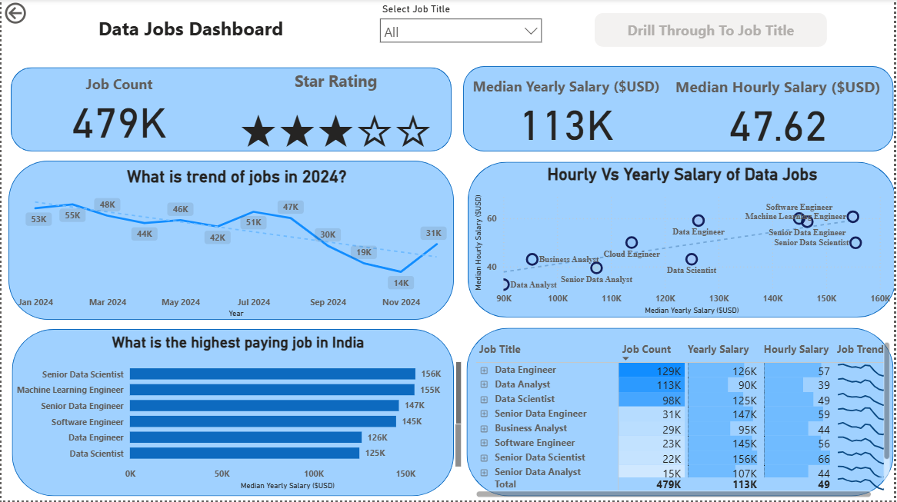

# 📊 Data Jobs Market Analysis Dashboard (Power BI)

## 🔍 Project Overview
Developed an interactive Power BI dashboard to analyze the global data job market, including job demand, salary trends, and role-based insights.

## 🎯 Business Objectives
- Analyze demand for various data roles
- Compare median yearly and hourly salaries
- Study job trends over time
- Enable detailed drill-through analysis by job title

## 📊 Key Metrics
- Job Count
- Median Yearly Salary
- Median Hourly Salary
- Average Job Rating

## 🛠 Tools & Technologies
- Power BI
- DAX
- Excel / CSV

## ⚙ Key Features
- Job title slicer
- Drill-through page for role-level insights
- Global job distribution map
- Salary comparison visuals

## 📷 Dashboard Preview

